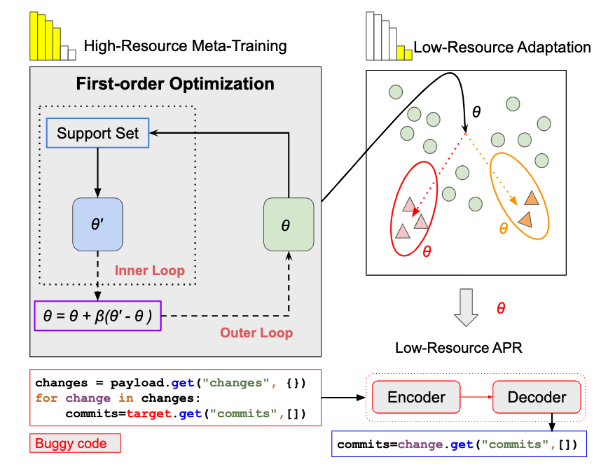

# Meta-APR

This is the official PyTorch implementation for the following EMNLP 2023 submitted paper from Salesforce Research:

*Title*: [Towards Low-Resource Automatic Program Repair with Meta-Learning and Pretrained Language Models](https://aclanthology.org/2023.emnlp-main.430/)

*Authors*: [Weishi Wang](https://www.linkedin.com/in/weishi-wang/), [Yue Wang](https://yuewang-cuhk.github.io/)
, [Shafiq Joty](https://raihanjoty.github.io/), and [Steven C.H. Hoi](https://sites.google.com/view/stevenhoi/home)

# What is this about?

In practical scenarios, software bugs have an imbalanced distribution, and the fixing knowledge learned by APR models
often only capture the
patterns of frequent error types, making it inapplicable to handle the rare error types. To address this limitation, we
present a novel low-resource APR formulation based on factual program defects from three benchmarks (main tasks),
including
tfix ([TFix in JavaScript](https://proceedings.mlr.press/v139/berabi21a.html) (deduplicated version)),
sb4j ([ManySStuBs4J in Java](https://dl.acm.org/doi/10.1145/3379597.3387491)) and
tssb ([TSSB-3M in Python](https://dl.acm.org/doi/10.1145/3524842.3528505)). We evaluate these novel low-resource APR
tasks,
and propose a new meta-learning framework integrated with code pretrained language models to generate fixes for
low-resource bugs with limited training samples.



## Folder Structure

You can specify and replace main task with tfix, sb4j or tssb. We evaluate on the full set of low resource scenarios.

 ```bash
├── evaluator: the source code of evaluation
│ 
├── sh: the bash shell script files to run experiments
│    
├── data
│   ├── main_high_resource : the dataset used to train and evaluate on high resource data for the main task
│   ├── main_low_resource_full : the dataset used to train and evaluate on low resource data for the main task
│   ├── main_high_resource_meta_crossfit : the dataset used to train Meta-APR on high resource data for the main task
│   ├── main_joint_K_shot: the dataset used for joint training with a mix of high and low (K-shot) resrouce data and evaluate on low resource for the main task
│   ├── main_low_resource_K_shot_N_seed: the dataset used to train and evaluate on low resource data (K-shot, N-seed) for the main task
│   ├── joint_upsampling_main_low_resource_K_shot_N_seed: the dataset used for joint training with a mix of high and low (K-shot, N-seed) resrouce data and evaluate on low resource for the main task with upsampling
└── 
```

## Download Pretrained and Fine-tuned Checkpoints

* [Fine-tuning data](https://)
* [Fine-tuned checkpoints](https://)

Instructions to download:

```
# pip install gsutil
cd your-cloned-Meta-APR-path

gsutil -m cp -r "gs://" .
gsutil -m cp -r "gs://" .
```

## Fine-tuning

### Dependency
```
- higher 0.2.1
- pickle5
- tqdm
- pandas 1.3.5
- tensorboard 2.4.1
- protobuf 3.15.8
- numpy 1.20.2
- transformers 4.24.0
- packaging 20.9
- tree-sitter 0.2.2
- python 3.7.9
For our A100-SXM4-40GB with CUDA capability sm_80 
  - Pytorch 1.7.1
  - torchvision 0.8.2
  - torchaudio==0.7.2
  - cudatoolkit=11.0
```
### How to run?

Go to `sh` folder, set the `WORKDIR` in `exp_with_args.sh` and `exp_with_args_meta_train.sh` to be your cloned Meta-APR
repository path.
You can use `run_exp.py` to run a broad set of experiments by simply passing the `model_tag`, `task`, and `sub_task`
arguments. In total, we support four models (i.e., ['codebert', 'codet5_small', 'codet5_base', 'unixcoder_base'])
and three main tasks: tfix ([TFix](https://proceedings.mlr.press/v139/berabi21a.html) data (deduplicated version)),
sb4j ([ManySStuBs4J](https://dl.acm.org/doi/10.1145/3379597.3387491)) and
tssb ([TSSB-3M](https://dl.acm.org/doi/10.1145/3524842.3528505)), comprising 108 tasks.

For example, if you want to run CodeT5-base model on the main task for tfix high-resource meta-learning with the
algorithm of Reptile, you can simply run:

```
python run_exp.py --do_meta_train_crossfit --do_reptile --model_tag codet5_base --task tfix_high_resource_meta_crossfit
```

You can specify:

```
do_meta_train_crossfit: Whether to run meta-learning on the main task high-resource error-specific data
do_reptile: Whether to run reptile as the meta-learning algorithm
do_maml: Whether to run maml as the meta-learning algorithm
Note that do_reptile/do_maml must pair together with do_meta_train_crossfit
```

For example, if you want to run CodeT5-base model on the main task for tfix high-resource for transfer-learning, you can
simply run:

```
python run_exp.py --model_tag codet5_base --task tfix_high_resource --tag_suffix transfer_learning
```
Then you can evaluate across 15 tfix low-resource tasks (K-shot, N-seed) with your finetuned checkpoint, please run:
```
python run_exp.py --model_tag codet5_base --task tfix_low_resource_K_shot_N_seed --load_model_dir YOUR_CHECKPOINT --tag_suffix transfer_from_high
```
Besides, you can specify:

```
model_dir: where to save fine-tuning checkpoints
res_dir: where to save the performance results 
summary_dir: where to save the training curves
data_num: how many data instances to use, the default -1 is for using the full data
gpu: the index of the GPU to use in the cluster
load_model_dir: where to reload the fine-tuned checkpoints
tag_suffix: indicate the purpose of experiments i.e., finetune. This is for annotation only, except for zeroshot.
``` 

You can also revise the suggested
arguments [here](https://) or directly customize the [exp_with_args.sh](https://)
and [exp_with_args_meta_train.sh](https://) bash file.
Please refer to the argument flags in [configs.py](https://) for the full
available options. The saved training curves in `summary_dir` can be visualized
using [tensorboard](https://pypi.org/project/tensorboard/).
Note that we employ one A100 GPU for all fine-tuning experiments.

### Reproduce the Results

---
* `cd sh` then run the inference via `run_exp.py`. 
* Pass the path of your downloaded finetuned checkpoint to load at [here](https://),
  e.g., `file = "xx/checkpoints/codet5_base_tfix_high_resource_reptile.bin"`
* Run the
  program: `python run_exp.py --model_tag codet5_base --task tfix_low_resource_K_shot_N_seed --load_model_dir file --tag_suffix zeroshot`

# Citation

```bibtex
@inproceedings{wang-etal-2023-towards-low,
    title = "Towards Low-Resource Automatic Program Repair with Meta-Learning and Pretrained Language Models",
    author = "Wang, Weishi  and
      Wang, Yue  and
      Hoi, Steven  and
      Joty, Shafiq",
    editor = "Bouamor, Houda  and
      Pino, Juan  and
      Bali, Kalika",
    booktitle = "Proceedings of the 2023 Conference on Empirical Methods in Natural Language Processing",
    month = dec,
    year = "2023",
    address = "Singapore",
    publisher = "Association for Computational Linguistics",
    url = "https://aclanthology.org/2023.emnlp-main.430",
    doi = "10.18653/v1/2023.emnlp-main.430",
    pages = "6954--6968",
    abstract = "Automatic program repair (APR) has gained increasing attention as an essential technique in software development to reduce manual debugging efforts and boost developers{'} productivity. Recent advances in deep learning (DL) based models have demonstrated promising results by learning from large-scale bug-fix examples in a data-driven manner. However, in practical scenarios, software bugs have an imbalanced distribution, and the fixing knowledge learned by APR models often only capture the patterns of frequent error types, making it inapplicable to handle the rare error types. To address this limitation, we investigate a novel task of low-resource APR, and propose Meta-APR, a new meta-learning framework integrated with code pretrained language models to generate fixes for low-resource bugs with limited training samples. Our Meta-APR learns better error-specific knowledge from high-resource bugs through efficient first-order meta-learning optimization, which allows for a faster adaptation to the target low-resource bugs. Besides, while we adopt CodeT5, a pretrained code-aware encoder-decoder Transformer, as the backbone model for Meta-APR, it is a model-agnostic framework that can be integrated with any neural models. Extensive experimental results on three benchmarks in various programming languages verify the superiority of our method over existing DL-based APR approaches.",
}
```


